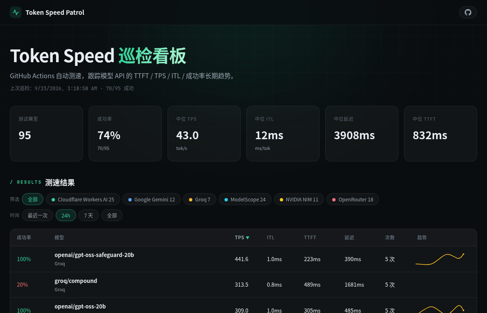

# Token Speed Patrol

LLM API 定时巡检 + 静态看板，跑在 GitHub Actions 上，零服务器、零成本。

GitHub Actions 定时对你的 LLM API 服务商测速（TTFT / TPS / 思考时长 / 成功率），结果以 JSONL 提交回仓库，GitHub Pages 发布看板展示趋势。所有数据公开可追溯——每一行历史都能在 git 里找到。

> **[👉 示例看板：95+ 免费模型实时测速数据](https://john-walks-slow.github.io/token-speed-patrol/)**



## 快速开始

1. **Fork 本仓库**
2. **启用 Actions**：你的 fork → Settings → Actions → Allow all actions（fork 默认禁用）
3. **配置密钥**：Settings → Secrets and variables → Actions，添加 Secret `PATROL_EXTRA_ENV`，内容为多行 `KEY=VALUE`（每个 key 对应 `patrol.json` 里的一个 `api_key_env`）：

   ```
   MY_API_KEY=sk-xxxx
   ANOTHER_API_KEY=sk-yyyy
   ```

4. **编辑 `config/patrol.json`**，填你要测的服务商（见下节）
5. **触发首次巡逻**：Actions → Token Speed Patrol → Run workflow
6. **开启 Pages**：Settings → Pages → Source: GitHub Actions

看板地址：`https://<你的用户名>.github.io/token-speed-patrol/`

## 配置格式

一切巡检行为都在 `config/patrol.json` 里声明，workflow 与代码零定制——改配置即生效，无需动代码。

```json
{
  "prompt": "Hello, tell me a short story in 3 sentences.",
  "max_tokens": 256,
  "stream": true,
  "concurrency": 1,
  "iterations": 1,
  "max_rpm": 20,
  "timeout": 120,
  "targets": [
    {
      "provider_name": "你的服务商名",
      "base_url": "https://api.xxx.com/v1",
      "api_key_env": "MY_API_KEY",
      "protocol": "openai",
      "models": ["model-id-1", "model-id-2"]
    }
  ]
}
```

### 字段说明

- `prompt` / `max_tokens` / `temperature` / `stream` / `timeout`：测速请求参数。
- `concurrency`：并发数；`iterations`：每模型重复次数（取均值，降噪）；`max_rpm`：全局限速（请求/分钟，`-1` 不限）。
- `provider_name`：看板上的展示名，随意取。
- `base_url`：OpenAI 兼容端点。支持 `"$ENV_NAME"` / `"${ENV_NAME}"` 引用环境变量（私有端点不落盘，结果中自动脱敏为 `(private)`）。
- `api_key_env`：**只存环境变量名，绝不写密钥明文**。密钥经 Secret `PATROL_EXTRA_ENV`（多行 `KEY=VALUE`）注入，runner 启动时读入。
- `protocol`：`openai`（绝大多数网关）或 `anthropic`（Anthropic 原生端点）。
- `models`：显式模型 id 列表。

### 动态模型发现

`"discover": true` 时，每轮巡检先从上游 `{base_url}/models` 拉全量模型列表，与手写 `models` 并集，再过过滤规则——上游增删模型自动跟随，不用维护列表：

```json
{
  "provider_name": "Example",
  "base_url": "https://api.xxx.com/v1",
  "api_key_env": "MY_API_KEY",
  "protocol": "openai",
  "models": [],
  "discover": true,
  "discover_url": "https://api.xxx.com/v2/models/search",
  "whitelist": [".*-chat$"],
  "blacklist": [".*(embed|vision).*"]
}
```

- `discover_url`：可选，默认 `{base_url}/models`；上游发现端点路径不标准时（如 Cloudflare 的 `/models/search`）单独指定。兼容 `{"data": [{"id"}]}`（OpenAI 风格）与 `{"result": [{"name"}]}`（Cloudflare 风格）两种响应。
- `whitelist` / `blacklist`：regex 数组（fullmatch）。并集先过 whitelist（空 = 全保留）再剔 blacklist。

### 自动黑名单

连续失败 5 次的模型自动拉黑，下一轮起不再巡检；成功一次即自动恢复。状态存在 `website/data/blacklist.json`（随巡检结果一起 commit，即巡检历史的持久层），记录每个模型当前的连续失败次数、最近错误和拉黑时间。间歇性失败（429/503）不会误伤，真下线/无权限的模型 5 轮后被剔除。手动恢复：删掉 `blacklist.json` 中对应条目（或整个文件）并 commit。

### 巡检周期与按需触发

- 周期在 `.github/workflows/patrol.yml` 的 `schedule.cron`（默认每 1 小时，按你的 API 限额调整）。
- 手动触发（Run workflow）时可填 `providers` 输入（逗号分隔 provider_name），只测指定服务商，不全量重跑。

## 免费公开端点巡检

本仓库自带一份当前（2026-09）主流免费端点的巡检配置并持续出数，作为活示范：Groq、NVIDIA NIM、Google Gemini、Cloudflare Workers AI、OpenRouter（`:free`）、ModelScope，覆盖约 95 个模型，模型列表尽量用上面的动态发现自动维护。

| Secret（走 `PATROL_EXTRA_ENV`） | 从哪获取密钥 | 免费限额（2026-09 实测口径） |
|---|---|---|
| `GROQ_API_KEY` | [console.groq.com/keys](https://console.groq.com/keys) — 永久免费层，无需信用卡 | 每模型 30 RPM / 1K~14.4K RPD |
| `NVIDIA_API_KEY` | [build.nvidia.com](https://build.nvidia.com/settings) — 免费试用额度，无需信用卡 | 账号级 ~40 RPM（NIM 模型共享池） |
| `GEMINI_API_KEY` | [aistudio.google.com](https://aistudio.google.com/apikey) — 免费层，无需信用卡 | flash 系 ~1500 RPD；**pro 系仅 ~50-100 RPD**（免费层最低的一档，RPD 太平洋时间午夜重置） |
| `CLOUDFLARE_API_KEY` | [dash.cloudflare.com](https://dash.cloudflare.com/profile/api-tokens) — Workers AI 免费额度 | **10K Neurons/天**（按 token 折算的硬顶）；文本 300 RPM；frontier 系大模型不在免费计划（403） |
| `OPENROUTER_API_KEY` | [openrouter.ai/keys](https://openrouter.ai/keys) | `:free` 模型 50 请求/天、20 RPM（账号级，UTC 午夜重置；充值 $10 后 1000 请求/天） |
| `MODELSCOPE_API_KEY` | [modelscope.cn](https://modelscope.cn/my/myaccesstoken) — 免费额度 | 2000 请求/天（全模型共享，0 点重置）+ 单模型动态 QPS |

限额政策、测速频率权衡、历史错误根因等调研记录见 `docs/features/260923-provider-coverage/`。

## 测速口径

- **TTFT**：首个可见 token（含 reasoning）延迟；**content TTFT**：首个正文 token。
- **TPS** = tokens_generated / 端到端总耗时（与 llmperf/lmsys 等主流基准一致）。
- **ITL**：扣除首字等待后的纯解码发射间隔。
- **思考时长**：仅当流中真实出现 reasoning 增量时可测；网关只转正文时为 null。
- token 数兼容两种 usage 口径（completion 含/不含 reasoning），经 `_reconcile_token_counts` 统一。

## 本地开发

```bash
pip install -r requirements.txt -r requirements-dev.txt
python -m pytest backend/ -q       # 后端测试
python -m http.server 8899 -d website   # 看板本地预览
```

## 相关项目

- [token-speed](https://github.com/john-walks-slow/token-speed) — 桌面版：多服务商管理、即时测速、本地历史统计（Windows）。

## License

MIT
